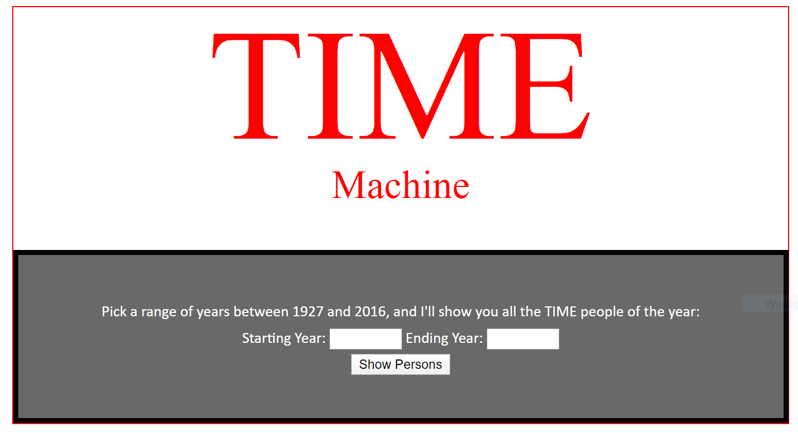

# Lab11-MVC
An ASP.NET MVC Core application, that will allow a user to input two different years, and a list of all the winners will be returned
by Harry Cogswell

## Description

This web application will show you all of TIME magazine's Person-Of-The-Year winners (between 1927 and 2016), depending on the user-inputted date range. Just select two years and it will generate a list for you! It develops these entries by accessing a local csv file containing all the winners and their information.

## Visual

## Use

Just go to [THIS LINK](https://timepersonmachineapp.azurewebsites.net) and enter two dates between 1927 and 2016, and press SUBMIT!

"TIME" Machine v1.0
